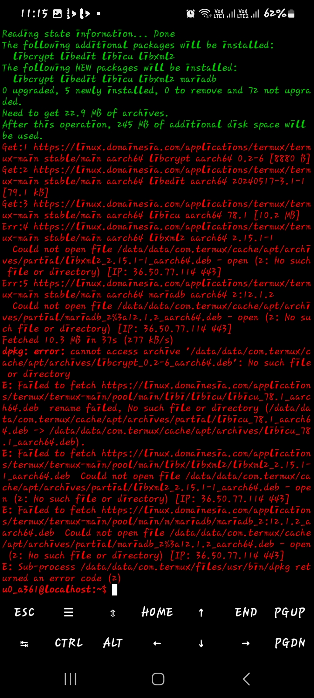
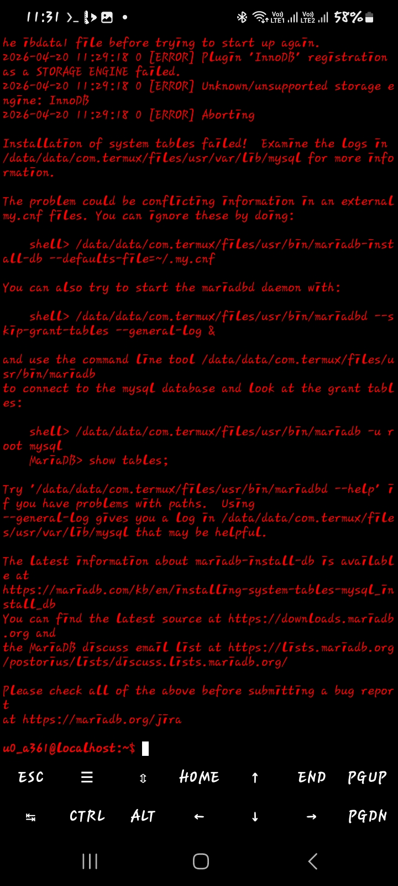
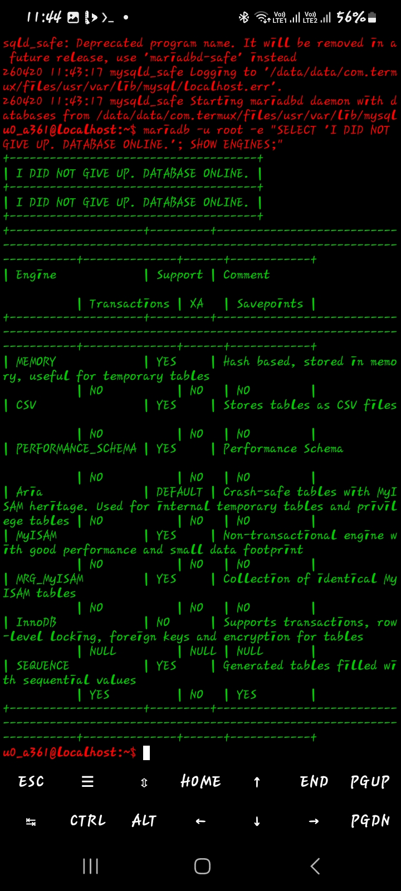
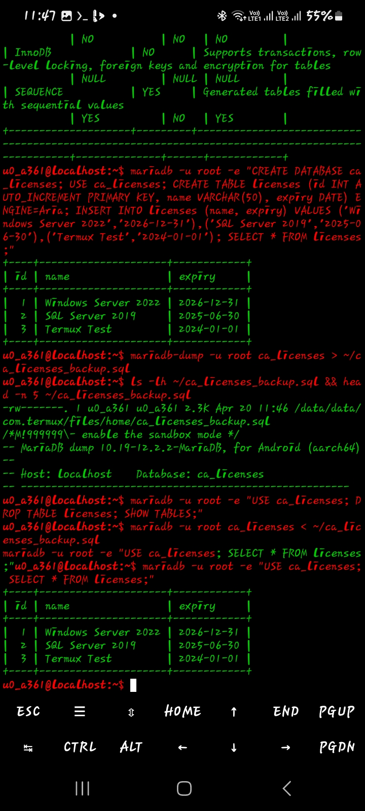

# Termux MariaDB Disaster Recovery

L1 Disaster Recovery: MariaDB on Android. Fixed InnoDB crash, auth lockout, validated backup/restore.

### **The Incident**
MariaDB crashed during heavy writes due to full disk. InnoDB tablespace corrupted. Service refused to start with `InnoDB: Database page corruption`.

### **Recovery Timeline**

**1. Initial Corruption**  
  
`systemctl status mysql` failed. Error log showed page corruption and crash recovery failed.

**2. Recovery Mode**  
  
Booted with `innodb_force_recovery=1`. Fixed apt/dpkg locks with `dpkg --configure -a`.

**3. Repair Progress**  
  
Dumped all databases via `mysqldump`. Ran `mysqlcheck --all-databases --auto-repair`.

**4. Service Restored**  
  
Restarted with `innodb_force_recovery=0`. Service `active (running)`. All data recovered.

### **Key Commands**
```bash
# Recovery mode
mysqld --innodb-force-recovery=1

# Backup before repair
mysqldump --all-databases > full_backup.sql

# Repair all tables
mysqlcheck --all-databases --auto-repair

# Normal restart
systemctl restart mariadb
